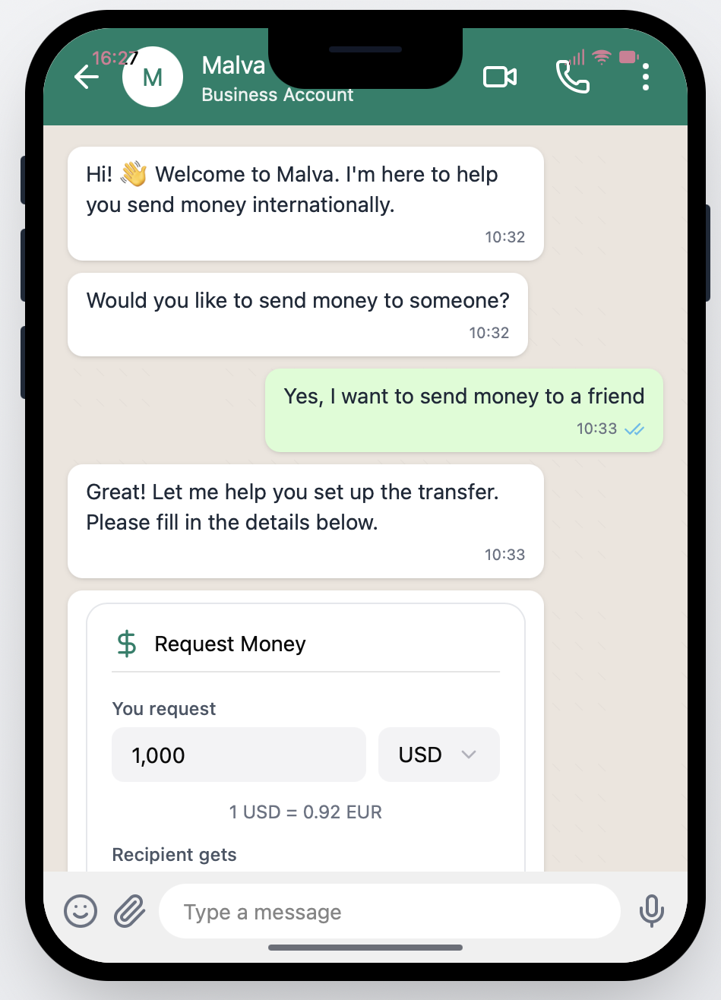
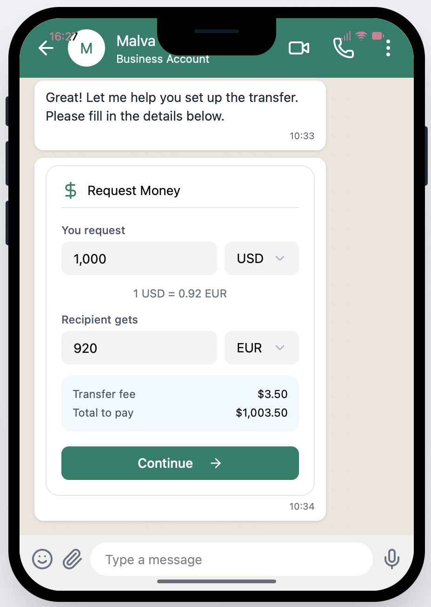
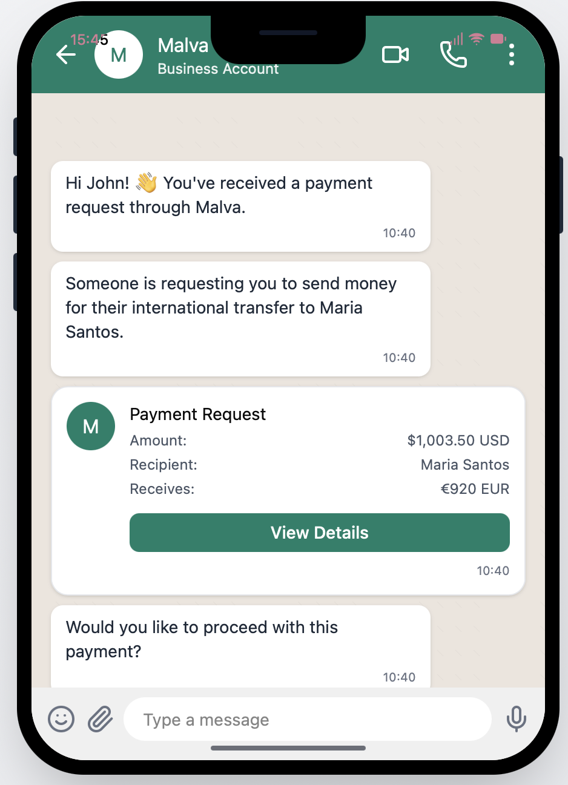

# AI Stablecoin Cross-Border Payments (Delivered via WhatsApp)

This platform lets users send international money transfers through WhatsApp, powered by stablecoin rails. Users initiate payouts conversationally in WhatsApp and the backend orchestrates KYC, customer creation, checkout, and settlement through Supabase Edge Functions + Bridge API + Stripe. This was done by integrating with bridge.xyz api. 

### Live Flow
The sender chats → enters payout → WhatsApp bot calls Supabase → bridge API moves funds → stablecoin settles instantly → recipient withdraws locally.
### Screenshots

#### Recipient Flow (WhatsApp)

| Step | Screenshot |
|------|------------|
| Onboarding |  |
| Enter amount |  |
| Confirm payout details |  |
| Recipient ready → funds incoming |  |

#### Sender Flow (WhatsApp)

| Step | Screenshot |
|------|------------|
| Review payment request |  |
| Confirm + authorize |  |
| Settlement triggered instantly |  |

### Architecture
| Folder | Purpose |
|--------|----------|
| `/backend/supabase` | Supabase Edge Functions handling transfers, webhooks, KYC, checkout |
| `/ui` | WhatsApp webhook handler + bot logic |
| `/backend/config.toml` + `demo.json` | Local testing config + sample payloads |

### Why this mattered
Traditional cross-border flows are slow and expensive. Stablecoins + messaging made it instant, lightweight and UX-native. 
